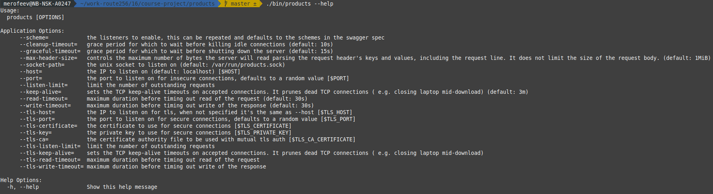
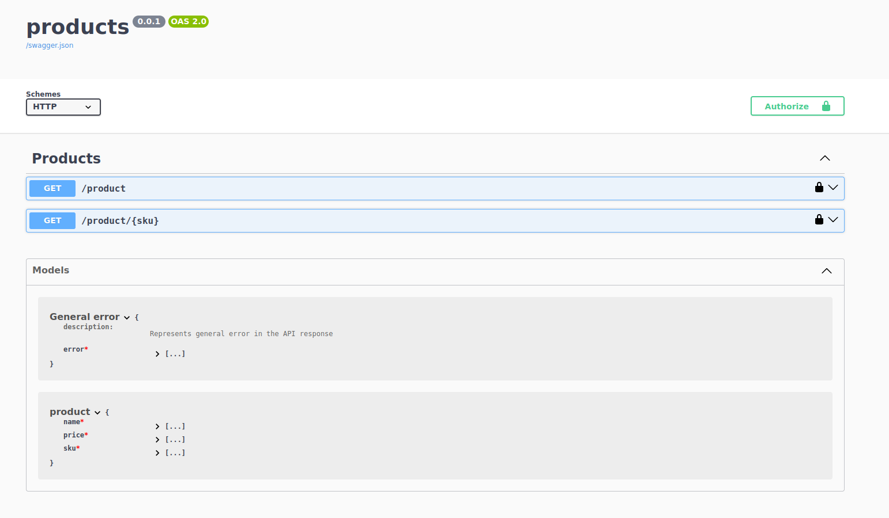

## products

Данный сервис служит каталогом продуктов и реализует операции:
- [списка продуктов](http://products:8082/docs/#/Products/getProducts): `http://products:8082/product`
- [поиск информации о продукте по sku](http://products:8082/docs/#/Products/getProduct): `http://products:8082/product/1076963`


### О проекте

Данный проект предоставляет примеры: 
 - сборки докер-образа сервиса с применением кеширования слоёв образов
 - разворачивания сервиса в наборе контейнеров ***docker compose***
 - применения ***Schema First*** подхода генерации исходного кода  
   по swagger-спецификации REST-вебсервиса. 


### Возможности локального запуска 

Проект закоммичен полностью готовым к сборке.  
***Makefile*** определяет следующие общие полезные рецепты: 

- `run` — *запуск локально по исходникам: `$ make run` — вызов*
- `build` — *сборка бинарника. Здесь и далее — аналогично `$ make ...`*

И рецепты, полезные в процессе разработки swagger-спецификации  
и реализации самого сервиса: 

- `.bin-deps` — *установит в локальный ./bin/ [go-swagger](https://github.com/go-swagger/go-swagger), используемый далее как валидатор и генератор*
- `.swagger-validate` — *валидация файла спецификации*
- `.generate` — *генерация шаблонного кода сервера и моделей*

Имеет смысл вызвать `make build`, затем с ключом вызвать `./bin/products --help`,  
чтобы увидеть, поддержку каких параметров запуска проекта мы имеем из коробки при генерации шаблонного кода.  




### Архитектура

Спускаясь от корня проекта ниже, интерес представляют следующие файлы: 

- `api/products.yaml` — *swagger-спецификация сервиса: контракт, определяющий его внешний API*
- `init/skus.json`, `init/data.json` — *набор данных сервиса*
- `internal/domain/...` — *бизнес-домен*
- `internal/infra/repository/...` — *хранилище данных сервиса* 
- `internal/app/http/handlers` — *http-обработчики операций*
- `internal/app/http/model` — *модели уровня API, сгенерированы*
- `internal/app/http/server` — *сгенерированный шаблонный код сервиса*
- `internal/app/http/server/configure_products.go` — *в сгенерированном коде это единственный файл,*  
  *предназначенный для редактирования. Редактированием этого файла конфигурируется итоговый сервис.*


### Спецификация сервиса

Спецификация в файле `swagger/products.yaml` написана по стандарту `swagger 2.0(OpenAPI 2.0)`.  
Описание этого формата можно найти [по адресу на гитхабе](https://github.com/OAI/OpenAPI-Specification/blob/main/versions/2.0.md),  
а по адресу [editor.swagger.io](https://editor.swagger.io/) доступен онлайн-редактор,  
где можно попрактиковаться в проектировании интерфейсов.

В файле спецификации присутствуют блоки: 

```yaml

swagger: '2.0'

info:
  title: products
  version: 0.0.1 

schemes:
    - http

consumes:
  - application/json
produces:
  - application/json
```

Общая информация о спецификации, о проекте, поддерживаемый протокол и  
поддерживаемые MIME-типы запросов и ответов.

Данные значения определяют умолчания операций.  
На уровне конкретных операций они могут быть переопределены.

```yaml

tags:
  - name: Products
```

Значения тагих тегов не определяют само API, однако,  
позволяют сгруппировать модели и операции в коде и в интерфейсе веб-страницы сваггера:




Переиспользуемые в границах данной спецификации шаблоны:

```yaml

definitions:

  error:
    description: Represents general error in the API response
    properties:
      error:
        description: the message of this error
        type: string
        x-isnullable: false
    required:
      - error
    title: General error
    type: object

securityDefinitions:
  api_key:
    type: apiKey
    name: X-API-KEY
    in: header


```

Шаблон `api_key` определяет политику доступа с HTTP-заголовком `X-API-KEY`.  
К защищённым операциям можно будет получить доступ лишь приложив к запросам  
данный заголовок с соответствующим значением.


Поддерживаемые сервисом операции:


```yaml

paths:

  /product:
    get:
      operationId: getProducts
      responses:
        '200':
          description: A successful response.
          schema:
            type: array
            items:
              $ref: '#/definitions/product'
        default:
          description: An unexpected error response.
          schema:
            $ref: '#/definitions/error'
      parameters:
        - name: count
          in: query
          description: Количество sku к возвращению
          type: integer
          format: int32
          default: 100
          minimum: 1
        - name: start_after_sku
          in: query
          description: После какого sku начать вывод
          type: integer
          format: int64
          default: 0
      tags:
        - Products
      security:
        - api_key: []


```

По пути `/product`, например, есть обработчик `get`-запросов,  
у которого предусмотрен ответ с 200 статусом и соответствующим телом и ответ, содержащий ошибку.  

В данном фрагменте ответ ошибки не накладывает ограничений на значение статуса.  
Определения соответствующих шаблонов нужно искать в блоке `definitions`.

Поле `operationId: getProducts` указывает генератору, как должен называться обработчик  
соответствующей операции в сгенерированном коде. 


### Dockerfile

Сборка образа докера в данном проекте проходит в две стадии.  
Сперва собирается образ `builder`:

```
FROM golang:latest AS builder

WORKDIR /app

COPY go.mod .
COPY go.sum .
RUN go mod download
```

В этой части в сборочный образ копируются файлы, декларирующие зависимости  
и эти зависимости скачиваются.  
Фаза эта времязатратная, но результирующий слой кешируется и при дальнейших сборках этот слой,  
если в `go.mod`/`go.sum` изменений не вносится, подбирается из кеша. 

`go mod download` следует размещать как можно выше в докер файле, как 
наиболее времязатратную инструкцию.

При построении того же образа, следом, выпопляются команды: 

```
COPY internal/ ./internal/
COPY cmd/ ./cmd/

RUN CGO_ENABLED=0 go build -a -o ./products-service ./cmd/products-server/

```
Здесь копируются исходники самого проекта и выполняется непосредственно сборка бинарника.

Вторая фаза выполняется `FROM scratch`, в ней собирается в общей куче набор файлов, необходимых  
сервису для функционирования.  

```
FROM scratch
```

```
COPY init/data.json ./init/
COPY init/skus.json ./init/

ENV TZ=Europe/Moscow
ENV PORT=8082
ENV HOST=0.0.0.0
EXPOSE 8082
COPY --from=builder /app/products-service /app/products-service

LABEL domain=route256 service=products

CMD ["./products-service"]

```

В данном случае это бинарник, собранный в первой фазе и файлы с данными и ещё кое-что.

Кроме этого, задаются значения переменных окружения,  
с которыми приложение сервиса будет выполняться **ВНУТРИ КОНТЕЙНЕРА**.

В даннном проекте явно указано значение `HOST` ( IP адрес, что сервер слушаает ) `0.0.0.0` — потому что  
в противном случае приложением сервиса будет применён `localhost`,  
который будет разрешён внутри контейнера и в этом случае доступа к сервису извне не будет.

Метка `LABEL` метит образ тегами.  
Данный сервис эту информацию не использует, но если вызвать  `docker inspect products`,  
эти значения появятся в выводе конфигурации образа.  
Имея возможность метить образа тегами, можно собирать утилиты управления образами,  
что может оказаться полезным, при активной сборке образов в горячем проекте.
