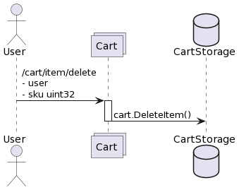
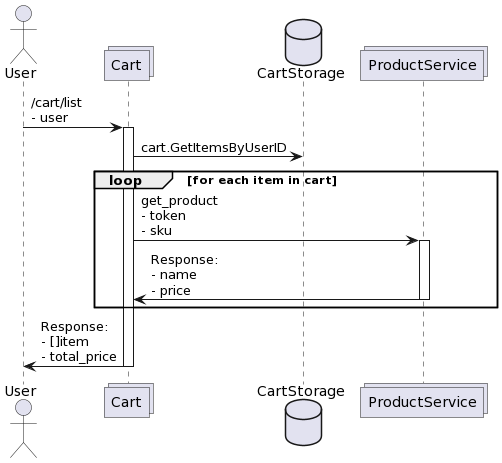
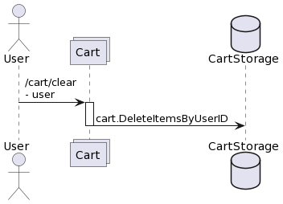

# LOMS (Logistics and Order Management System)

Сервис отвечает за учет заказов и стоки по товарам.

## POST order/create

Создает новый заказ для пользователя из списка переданных товаров с резервированием нужного количества стоков


Request
```
{
    user int64
    items []{
        sku uint32
        count uint16
    }
}
```

Response
```
{
    orderID int64
}
```

## POST order/info

Показывает информацию по заказу


Request
```
{
    orderID int64
}
```

Response
```
{
    status string // (new | awaiting payment | failed | payed | cancelled)
    user int64
    items []{
        sku uint32
        count uint16
    }
}
```

## POST order/pay

Помечает заказ оплаченным. Зарезервированные товары должны перейти в статус купленных.


Request
```
{
    orderID int64
}
```

Response
```
{}
```

## POST order/cancel

Отменяет заказ, снимает резерв со всех товаров в заказе.


Request
```
{
    orderID int64
}
```

Response
```
{}
```

## POST stock/info

Возвращает количество товаров, которые можно купить с разных складов. Если товар был зарезерванован у кого-то в заказе и ждет оплаты, его купить нельзя.


Request
```
{
    sku uint32
}
```

Response
```
{
    count uint64
}
```

# cart

Сервис отвечает за пользовательскую корзину и позволяет оформить заказ.

## POST cart/item/add

Добавить товар в корзину определенного пользователя. При этом надо проверить проверить наличие доступных стоков через ручку loms/stocks.


Request
```
{
    user int64
    sku uint32
    count uint16
}
```

Response
```
{}
```

## POST cart/item/delete

Удалить товар из корзины определенного пользователя.



Request
```
{
    user int64
    sku uint32
}
```

Response
```
{}
```

## POST cart/list

Показать список товаров в корзине с именами и ценами (их надо в реальном времени получать из ProductService)



Request
```
{
    user int64
}
```

Response
```
{
    items []{
        sku uint32
        count uint16
        name string
        price uint32
    }
    totalPrice uint32
}
```

## POST cart/clear

Удалить все товары, лежащие в корзине пользователя



Request
```
{
    user int64
}
```

Response
```
{
}
```

## POST cart/checkout

Оформить заказ по всем товарам корзины. Вызывает loms/order/create.


Request
```
{
    user int64
}
```

Response
```
{
    orderID int64
}
```

# Notifications

Будет слушать Кафку и отправлять уведомления, внешнего API нет.

# ProductService

Swagger развернут по адресу:
http://route256.pavl.uk:8080/docs/

GRPC развернуто по адресу:
route256.pavl.uk:8082

## get_product

Request
```
{
    token string
    sku uint32
}
```

Response
```
{
    name string
    price uint32
}
```

## list_skus

Request
```
{
    token string
    startAfterSku uint32
    count uint32
}
```

Response
```
{
    skus []uint32
}
```


# Взаимодействие с корзиной пользователя (сервис cart):

- cart/item/add - добавление нужного количества товара по SKU в корзину пользователя
  + для проверки возможности добавления необходимо проверить
    + валидность SKU через ProductService.get_product
    + наличие доступных стоков через ручку loms/stocks
- cart/item/delete - удаление товара по SKU из корзины пользователя
- cart/list - вывод информации о составе корзины
  + цены и названия товаров необходимо получить из ProductService.get_product
- cart/clear - удаление всех товаров, лежащих в корзине пользователя
- cart/checkout - оформление заказа по текущему составу корзины
  + для создания заказа дергаем ручку loms/order/create, которая возвращает идентификатор заказа
    

# Взаимодействие с сервисом управления заказами (loms):

- order/create
  + заказ получает статус "new"
  + резервирует нужное количество единиц товара
  + если удалось зарезервировать стоки, заказ получает статус "awaiting payment"
  + если не удалось зарезервировать стоки, заказ получает статус "failed"
- order/pay - оплата заказа по идентификатору заказа
  + удаляем зарезервированные стоки на товаре
  + заказ получает статус "payed"
- order/cancel - отмена заказа по идентификатору заказа 
  + зарезервированные стоки на товаре становятся свободными стоками
  + заказ получает статус "cancelled"
- сервис loms должен самостоятельно отменять заказы, неоплаченные в течении 10 минут


# Путь покупки товаров:

- cart/item/add - добавляем в корзину и проверяем, что есть в наличии)
- cart/item/delete Можем удалять из корзины
- cart/list - можем получать список товаров корзины
- cart/checkout - приобретаем товары 
- order/pay Оплачиваем заказ
- order/cancel отмена заказ до оплаты